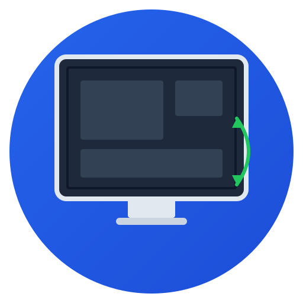

# OpenDesk

<p align="center">
  
</p>

Multi-platform remote desktop application (TeamViewer / AnyDesk-like).

[](https://pypi.org/project/opendesk/)
[](https://pypi.org/project/opendesk/)
[](https://github.com/opendesk/opendesk-client/blob/main/LICENSE)
[](https://github.com/opendesk/opendesk-client/actions/workflows/ci.yml)

- **Platforms:** Windows, macOS, Linux
- **Tech:** Python 3.12+, PySide6 (Qt6), PyAV (FFmpeg), E2E encryption
- **Network:** TCP relay with P2P support
- **Features:** Screen sharing, remote control, file transfer, clipboard sync,
  microphone streaming, webcam streaming with PiP overlay, audio, chat, multi-monitor

---

## Install

### Quick install (bootstrap)

```bash
# Linux / macOS
curl -fsSL https://opendesk.io/bootstrap.sh | bash
```

```powershell
# Windows (PowerShell as Administrator)
iwr -useb https://opendesk.io/bootstrap.ps1 | iex
```

The bootstrap script handles:
1. ✅ Python 3.12+ installation (if missing)
2. ✅ System dependencies (ffmpeg, libxtst, pipewire, etc.)
3. ✅ `pip install opendesk` (or `pipx install opendesk`)
4. ✅ Desktop entry / Start Menu shortcut

### Via pip

```bash
pip install opendesk
```

> **Tip:** Use [pipx](https://pipx.pypa.io/) for isolated app installation:
> `pipx install opendesk`

### Via uv (development)

```bash
git clone https://github.com/opendesk/opendesk-client
cd opendesk-client
uv sync
uv run opendesk
```

### Post-install: system dependencies

After installing, run this to make sure all system packages are present:

```bash
opendesk --install-system-deps
```

## Usage

```bash
opendesk                   # Start the remote desktop client
opendesk --log-level=WARNING  # Quieter logging
opendesk-host              # Start host-only version (incoming only)
opendesk --help            # Show all options
```

## OpenDesk Host (solo incoming)

Versione ridotta di OpenDesk che funge solo da **host** (nessuna connessione
in uscita).  Si connette al relay, mostra **Your ID** e **Password** in una
finestra compatta, e accetta connessioni in ingresso con streaming, input
remoto, chat e file transfer.

```bash
uv run opendesk-host                      # Avvia la versione host-only
uv run opendesk-host --minimized          # Avvia ridotto a icona nella system tray
uv run opendesk-host --log-level=WARNING
```

### Avvio automatico ridotto a icona

`--minimized` (alias `--tray`) avvia l'app nascosta nella **system tray**:
resta in esecuzione in background, mostra l'icona con il menu contestuale
(*Show window*, *New Session*, *Copy ID*, *Copy password*, *Quit*) e la
sessione continua anche se si chiude la finestra con la ✕.

Per avviare l'host automaticamente al login/boot del sistema (Linux):

```bash
# Metodo 1 — servizio systemd utente (parte al login grafico)
cp systemd/opendesk-host.user.service ~/.config/systemd/user/opendesk-host.service
systemctl --user daemon-reload
systemctl --user enable --now opendesk-host

# Metodo 2 — autostart XDG (creato automaticamente dall'installer)
# ~/.config/autostart/opendesk-host.desktop
```

Su Windows aggiungere un collegamento a `opendesk-host --minimized` nella
cartella *Esecuzione automatica*; su macOS usare un LaunchAgent.

### Cosa fa

- All'avvio si connette al relay e mostra ID + password
- Con `--minimized` parte direttamente nella **system tray** senza finestra
- Accetta solo connessioni **in ingresso** — nessun pannello dispositivi
- Quando un client remoto si connette: **streaming schermo**, **input remoto**
- **Chat** e **File transfer** si attivano automaticamente su richiesta del remoto
- **Settings** per pre-autorizzazione dispositivi (bypass password), video, rete

### Cosa NON fa (rispetto a OpenDesk completo)

- ❌ Connessioni in uscita verso altri computer
- ❌ Viewer remoto (schermo di un altro PC)
- ❌ Ricerca dispositivi nella rete
- ❌ Pulsanti manuali per chat / file transfer (solo da remoto)
- ❌ Clipboard sync, webcam remota

## Development

```bash
# Clone and install from source
git clone https://github.com/opendesk/opendesk-client
cd opendesk-client
uv sync --dev          # install with dev dependencies

# Or with pip
pip install -e ".[dev]"

# Run tests
uv run pytest          # run tests
uv run pytest -v       # verbose

# Code quality
uv run black .         # format code
uv run ruff check .    # lint
uv run mypy opendesk/  # type check
```

### Optional features

```bash
# Audio streaming (microphone) — requires soundcard
pip install opendesk[audio]
```

### Wayland setup (Linux)

Wayland support is **built-in** (dbus-next, evdev are auto-installed on Linux).
You still need **system packages**:

```bash
# Ubuntu/Debian
sudo apt install gstreamer1.0-pipewire python3-gi       \
                 xdg-desktop-portal pipewire

# Optional: accurate absolute mouse positioning
sudo apt install ydotool

# Required: uinput permissions for remote input
sudo usermod -aG input $USER
# (log out and back in)
```

**Supported backends** (auto-detected in order):

| Backend | Capture | Input | Notes |
|---------|---------|-------|-------|
| **PORTAL** | D-Bus + GStreamer | — | Reuses portal session, no double dialog |
| **PIPEWIRE** | GStreamer pipewiresrc | — | Shows its own screen-selection dialog |
| **MSS** | X11 | X11 (Xlib) | Fallback via XWayland |
| **uinput** | — | evdev uinput | Requires `input` group |
| **ydotool** | — | ydotool | Absolute mouse on Wayland |

## Architecture

```
opendesk/
├── opendesk/          # Main application (~50 files, ~13k LOC)
│   ├── core/          # Screen capture, input, codec, audio, camera, recording
│   ├── network/       # Protocol, P2P, relay, NAT traversal
│   ├── crypto/        # E2E encryption (NaCl Box), Argon2 auth
│   ├── services/      # Streaming pipeline, connection service
│   ├── ui/            # PySide6 widgets + QSS themes (light/dark)
│   ├── host_app.py    # OpenDesk Host: entry point incoming-only
│   └── utils/         # Logging, platform detection
├── tests/             # 123+ tests — unit, integration, edge cases
└── uv.lock            # Locked dependencies
```

## Video encoding

OpenDesk uses **PyAV** (FFmpeg bindings) for H.264/H.265 video encoding
with hardware acceleration support.

### Quality presets

| Level | CRF | Bitrate (legacy) | Use case |
|-------|-----|-------------------|----------|
| **LOW** | 32 | ~0.5 Mbps | Slow connections |
| **MEDIUM** | 27 | ~2 Mbps | Balanced |
| **HIGH** (default) | 23 | ~8 Mbps | Good quality |
| **LOSSLESS** | 16 | ~20+ Mbps | LAN / near-lossless |

CRF (Constant Rate Factor) is the default rate control mode, providing
consistent visual quality by dynamically allocating bits where needed.

### Codec support

OpenDesk supports multiple codecs, auto-detected in order of preference:

| Codec | Type | When available |
|-------|------|----------------|
| `hevc_nvenc` | HW (NVIDIA) | NVIDIA GPU + drivers |
| `h264_nvenc` | HW (NVIDIA) | NVIDIA GPU + drivers |
| `hevc_amf` | HW (AMD) | AMD GPU + drivers |
| `h264_amf` | HW (AMD) | AMD GPU + drivers |
| `hevc_vaapi` | HW (Intel/AMD) | VAAPI drivers (Linux) |
| `h264_vaapi` | HW (Intel/AMD) | VAAPI drivers (Linux) |
| `hevc_videotoolbox` | HW (Apple) | macOS |
| `h264` (libx264) | SW | Always available |

Select the codec in **Tools → Settings → Video → Encoder**.

### Resolution scaling

Reduce resolution before encoding to save bandwidth
(**Tools → Settings → Video → Resolution**):

- **Full (1:1)** — maximum quality
- **75%, 50%, 25%** — for slower connections

Scaling before encoding is more effective than lowering bitrate:
a smaller sharp image looks better than a larger blurry one.

## Streaming pipeline

The screen capture, encoding, and network send run on **3 independent worker threads**:

```
┌────────────────┐    queue(max=3)   ┌────────────────┐   queue(max=30)   ┌────────────────┐
│ CaptureWorker  │─── frame_queue ──►│ EncoderWorker  │─── pkt_queue ────►│ NetworkWorker  │
│ (thread)       │                   │ (thread)       │                   │ (thread)       │
│ 30fps costanti │                   │ H.264/H.265    │                   │ relay.send()   │
│ resolution     │                   │ CRF / bitrate  │                   │ frame + tile   │
│ scaling        │                   │ full keyframe  │                   │                │
└────────────────┘                   │ tile JPEG      │                   └────────────────┘
                                     └────────────────┘
```

- **Back-pressure:** if the encoder is slow, the frame queue fills up and
  frames are dropped instead of accumulating latency.
- **Watchdog:** if CaptureWorker fails (e.g. no screen access), the
  EncoderWorker detects the stall within 5 seconds and stops the pipeline.

## Incremental tile updates

When only small regions of the screen change (e.g. typing, mouse movement),
OpenDesk uses **128×128 JPEG tiles** instead of a full H.264 keyframe:

- Changed tiles are detected via vectorised NumPy diff
- Each changed tile is JPEG-encoded at the configured quality level
- The receiver composites tiles onto the last full keyframe reference
- If >30% of tiles changed, a full keyframe is sent instead (more efficient)

This approach saves bandwidth and encoding CPU for typical desktop usage.

## Microphone & Webcam

OpenDesk can stream your microphone and webcam to the remote peer, enabling
voice and video communication alongside the remote desktop.

### Microphone 🎤

- Captures audio from the default microphone, encodes it with **Opus** (via PyAV),
  and sends it as `AUDIO_FRAME` messages over the relay.
- On the receiving side, audio is decoded and played through the default speaker.
- Requires the optional `soundcard` library:

  ```bash
  uv sync --extra audio
  ```

- Enable in **Tools → Settings → General → Audio (Microphone)** or click the
  **🎤 Mic** button in the toolbar during a session.

> **Note:** If `soundcard` is not installed or the Opus codec is unavailable,
> the microphone feature is gracefully disabled and the streaming pipeline
> continues to work unaffected.

### Webcam 📷

- Captures video from the default webcam using **OpenCV** (`cv2.VideoCapture`),
  encodes frames as JPEG, and sends them as `CAMERA_FRAME` messages.
- On the receiving side, the webcam feed appears as a **picture-in-picture
  overlay** in the top-right corner of the remote desktop viewer.
- OpenCV is already a core dependency — no extra packages needed.

  ```
  ┌──────────────────────────────────┐
  │                                  │
  │  Remote desktop                  │
  │              ┌──────────┐        │
  │              │ 📷 Cam   │        │
  │              │ 240×180  │        │
  │              └──────────┘        │
  │                                  │
  └──────────────────────────────────┘
  ```

- Configure in **Tools → Settings → General → Camera (Webcam)**:
  - Select camera device (auto-detected)
  - Choose quality preset (Low / Medium / High)
- Toggle during a session with the **📷 Camera** toolbar button.

### Toolbar controls

When a remote session is active, the toolbar shows:

| Button | Action |
|--------|--------|
| **🎤 Mic** | Toggle microphone streaming (green = active) |
| **📷 Camera**  | Toggle webcam streaming (green = active) |

The status bar also shows **Mic On/Off** and **Cam On/Off** indicators.

### Camera PiP overlay

The remote webcam feed appears as a **draggable picture-in-picture** overlay in the
top-right corner of the viewer window:

- **Drag** the overlay to reposition it anywhere in the viewer
- Click the **✖ button** (red) to close/hide the overlay
- Re-enable with the **📷 Camera** toolbar button

### Architecture

```
┌─ HOST ──────────────────────────────┐
│                                      │
│  AudioManager (thread)               │
│    → soundcard.record()              │
│    → Opus encode                     │
│    → AUDIO_FRAME → relay             │
│                                      │
│  CameraManager (thread)              │
│    → cv2.VideoCapture()              │
│    → JPEG encode                     │
│    → CAMERA_FRAME → relay            │
│                                      │
│  StreamingPipeline (3 threads)       │
│    → screen capture → H.264 → relay  │
└──────────────────────────────────────┘

┌─ CLIENT ─────────────────────────────┐
│                                       │
│  AudioManager.play_audio_frame()      │
│    → Opus decode → soundcard.play()   │
│                                       │
│  ViewerWindow                         │
│    ├── RemoteViewer (screen)          │
│    └── Camera PiP overlay (top-right) │
│                                       │
│  CAMERA_FRAME → update_camera_frame() │
└──────────────────────────────────────┘
```

## Commands

```bash
opendesk                     # Start the remote desktop client
opendesk-release             # Start in release mode (WARNING+ messages only)
opendesk-host                # Start the host-only version (incoming only)
opendesk --log-level=WARNING # Custom log level
opendesk --install-system-deps  # Show system dependency installation guide

# Development (from source)
uv run opendesk              # Start from source via uv
uv run pytest                # Run all tests
```

### Log level

Log verbosity is controlled by (highest precedence first):

1. **`--log-level`** CLI argument — `opendesk --log-level=WARNING`
2. **`OPENDESK_LOG_LEVEL`** environment variable — `OPENDESK_LOG_LEVEL=ERROR opendesk`
3. **Entry point default** — `opendesk` defaults to `DEBUG` (development),
   `opendesk-release` defaults to `WARNING` (distribution)

Valid values: `DEBUG`, `INFO`, `WARNING`, `ERROR`, `CRITICAL`.

## Relay server

Il relay server è ora un'app standalone separata in **`../opendesk-relay`** (o
[github.com/opendesk/opendesk-relay](https://github.com/opendesk/opendesk-relay)).

Documentazione completa e istruzioni nel README del progetto relay:

```bash
cd ../opendesk-relay
cat README.md
```

### Avvio rapido

```bash
cd ../opendesk-relay
uv sync
uv run relay-server --port 8474
```

### Installazione come servizio systemd (Linux)

```bash
sudo ./opendesk-relay/install-relay.sh --port 8474
# (dalla directory opendesk, o esegui dal progetto opendesk-relay)
```

### Configurazione client OpenDesk

Nelle impostazioni del client OpenDesk (Tools → Settings → Network), imposta:

| Campo | Valore |
|-------|--------|
| **Relay Host** | IP pubblico del server |
| **Relay Port** | 8474 (o la porta configurata) |
| **Enable relay** | ✅ |
