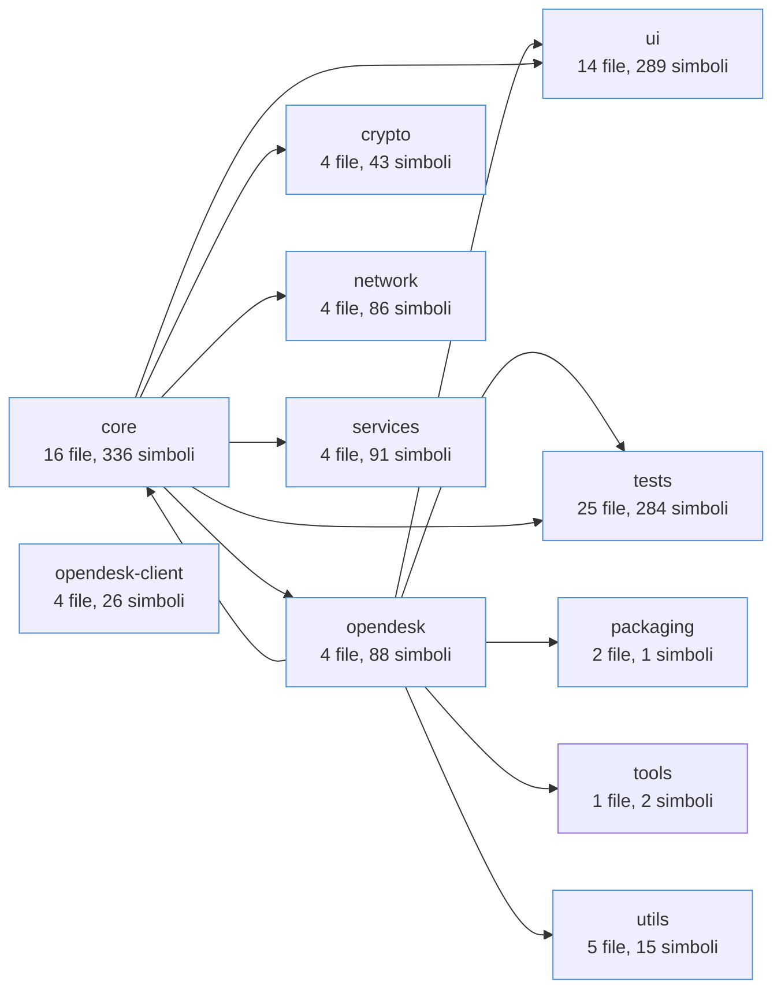
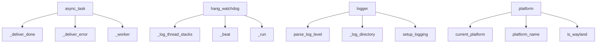

# Schema Codebase

> Generato automaticamente dall'estensione `codebase-mapper`.

## Panoramica

- **File sorgente**: 83
- **Righe totali**: 26.003
- **Linguaggi**: python (83)
- **Moduli**: 11

## Funzionalità per modulo

| Modulo | Percorso | File | Simboli | Entry point |
|---|---|---|---|---|
| tests | `tests` | 25 | 284 | main, drain, write_msg, read_msg, run_host |
| core | `opendesk/core` | 16 | 336 | main, on_error, on_eos, run_full_benchmark, auto_tune_encoder |
| ui | `opendesk/ui` | 14 | 289 | - |
| utils | `opendesk/utils` | 5 | 15 | parse_log_level, setup_logging, current_platform, platform_name, is_wayland |
| opendesk-client | `(root)` | 4 | 26 | detect_platform, run_cmd, install_system_deps_windows, install_system_deps_linux, install_system_deps_darwin |
| opendesk | `opendesk` | 4 | 88 | load_stylesheet, toggle_theme, get_current_theme, main_release, install_system_deps |
| crypto | `opendesk/crypto` | 4 | 43 | hash_password, verify_password, needs_rehash, generate_session_id, generate_otp |
| network | `opendesk/network` | 4 | 86 | - |
| services | `opendesk/services` | 4 | 91 | - |
| packaging | `packaging` | 2 | 1 | main |
| tools | `tools` | 1 | 2 | find_opendesk_host_process, main |

## Oggetti (classi, interfacce, entità)

| Nome | Tipo | File | Riga |
|---|---|---|---|
| AudioDirection | class | `opendesk/core/audio_manager.py` | 38 |
| AudioConfig | class | `opendesk/core/audio_manager.py` | 48 |
| OpusCodec | class | `opendesk/core/audio_manager.py` | 63 |
| AudioManager | class | `opendesk/core/audio_manager.py` | 192 |
| EncoderBenchResult | class | `opendesk/core/benchmark.py` | 40 |
| BenchmarkReport | class | `opendesk/core/benchmark.py` | 60 |
| CameraState | class | `opendesk/core/camera_manager.py` | 44 |
| CameraConfig | class | `opendesk/core/camera_manager.py` | 54 |
| CameraManager | class | `opendesk/core/camera_manager.py` | 147 |
| ClipboardSync | class | `opendesk/core/clipboard_sync.py` | 41 |
| DeviceEntry | class | `opendesk/core/device_registry.py` | 25 |
| DeviceRegistry | class | `opendesk/core/device_registry.py` | 39 |
| TransferDirection | class | `opendesk/core/file_transfer.py` | 55 |
| TransferState | class | `opendesk/core/file_transfer.py` | 60 |
| FileInfo | class | `opendesk/core/file_transfer.py` | 71 |
| TransferJob | class | `opendesk/core/file_transfer.py` | 93 |
| _BgEventLoop | class | `opendesk/core/file_transfer.py` | 115 |
| FileTransferManager | class | `opendesk/core/file_transfer.py` | 169 |
| MouseButton | class | `opendesk/core/input_injection.py` | 39 |
| KeyState | class | `opendesk/core/input_injection.py` | 47 |
| MouseEvent | class | `opendesk/core/input_injection.py` | 54 |
| KeyboardEvent | class | `opendesk/core/input_injection.py` | 63 |
| InputBackend | class | `opendesk/core/input_injection.py` | 74 |
| X11InputBackend | class | `opendesk/core/input_injection.py` | 111 |
| WaylandInputBackend | class | `opendesk/core/input_injection.py` | 265 |
| _MOUSEINPUT | class | `opendesk/core/input_injection.py` | 791 |
| HealthSeverity | class | `opendesk/core/platform_config.py` | 32 |
| HealthIssue | class | `opendesk/core/platform_config.py` | 39 |
| CaptureMethod | class | `opendesk/core/platform_config.py` | 64 |
| PlatformConfig | class | `opendesk/core/platform_config.py` | 178 |
| MonitorInfo | class | `opendesk/core/screen_capture.py` | 42 |
| CapturedFrame | class | `opendesk/core/screen_capture.py` | 59 |
| PipeWireCapture | class | `opendesk/core/screen_capture.py` | 140 |
| ScreenCapture | class | `opendesk/core/screen_capture.py` | 510 |
| CURSORINFO | class | `opendesk/core/screen_capture.py` | 1113 |
| ICONINFO | class | `opendesk/core/screen_capture.py` | 1145 |
| BITMAPINFOHEADER | class | `opendesk/core/screen_capture.py` | 1154 |
| BITMAP | class | `opendesk/core/screen_capture.py` | 1182 |
| RecordingStatus | class | `opendesk/core/screen_recorder.py` | 27 |
| ScreenRecorder | class | `opendesk/core/screen_recorder.py` | 44 |
| UnattendedConfig | class | `opendesk/core/unattended.py` | 24 |
| UnattendedAccess | class | `opendesk/core/unattended.py` | 37 |
| QualityLevel | class | `opendesk/core/video_codec.py` | 92 |
| EncoderConfig | class | `opendesk/core/video_codec.py` | 129 |
| EncodedPacket | class | `opendesk/core/video_codec.py` | 170 |
| VideoEncoder | class | `opendesk/core/video_codec.py` | 186 |
| VideoDecoder | class | `opendesk/core/video_codec.py` | 553 |
| WaylandCaptureSession | class | `opendesk/core/wayland_capture.py` | 44 |
| WaylandScreenCast | class | `opendesk/core/wayland_capture.py` | 54 |
| StoredCredential | class | `opendesk/crypto/auth.py` | 128 |
| PendingSession | class | `opendesk/crypto/auth.py` | 138 |
| AuthManager | class | `opendesk/crypto/auth.py` | 152 |
| CryptoKeyPair | class | `opendesk/crypto/e2ee.py` | 36 |
| EncryptedMessage | class | `opendesk/crypto/e2ee.py` | 87 |
| E2EEncryption | class | `opendesk/crypto/e2ee.py` | 115 |
| HostService | class | `opendesk/host_app.py` | 63 |
| HostWindow | class | `opendesk/host_app.py` | 563 |
| ExternalEndpoint | class | `opendesk/network/nat_traversal.py` | 18 |
| TURNServer | class | `opendesk/network/nat_traversal.py` | 27 |
| STUNProtocol | class | `opendesk/network/nat_traversal.py` | 88 |
| MessageType | class | `opendesk/network/protocol.py` | 40 |
| Message | class | `opendesk/network/protocol.py` | 116 |
| RelayRole | class | `opendesk/network/relay_client.py` | 53 |
| _RelaySession | class | `opendesk/network/relay_client.py` | 76 |
| RelayClient | class | `opendesk/network/relay_client.py` | 1044 |
| ConnectionService | class | `opendesk/services/connection_service.py` | 32 |
| PipelineConfig | class | `opendesk/services/pipeline.py` | 66 |
| CaptureWorker | class | `opendesk/services/pipeline.py` | 88 |
| EncoderWorker | class | `opendesk/services/pipeline.py` | 215 |
| NetworkWorker | class | `opendesk/services/pipeline.py` | 576 |
| StreamingPipeline | class | `opendesk/services/pipeline.py` | 637 |
| InputInjectionWorker | class | `opendesk/services/stream_service.py` | 89 |
| StreamService | class | `opendesk/services/stream_service.py` | 162 |
| ChatPanel | class | `opendesk/ui/chat_panel.py` | 26 |
| DeviceListModel | class | `opendesk/ui/connections.py` | 51 |
| DeviceDelegate | class | `opendesk/ui/connections.py` | 131 |
| ConnectionPanel | class | `opendesk/ui/connections.py` | 212 |
| SessionStatusWidget | class | `opendesk/ui/connections.py` | 600 |
| RemoteFileSystemModel | class | `opendesk/ui/file_transfer_ui.py` | 81 |
| TransferListModel | class | `opendesk/ui/file_transfer_ui.py` | 414 |
| TransferDelegate | class | `opendesk/ui/file_transfer_ui.py` | 520 |
| FileBrowserDock | class | `opendesk/ui/file_transfer_ui.py` | 641 |
| MainWindow | class | `opendesk/ui/main_window.py` | 50 |
| MonitorSelector | class | `opendesk/ui/monitor_selector.py` | 30 |
| MonitorSwitcherWidget | class | `opendesk/ui/monitor_selector.py` | 147 |
| SessionInfoWidget | class | `opendesk/ui/session_info.py` | 29 |
| SettingsDialog | class | `opendesk/ui/settings_dialog.py` | 44 |
| CameraOverlay | class | `opendesk/ui/viewer.py` | 79 |
| RemoteViewer | class | `opendesk/ui/viewer.py` | 183 |
| FitMode | class | `opendesk/ui/viewer.py` | 207 |
| ViewerToolbar | class | `opendesk/ui/viewer.py` | 802 |
| ViewerWindow | class | `opendesk/ui/viewer.py` | 907 |
| EmptyStateWidget | class | `opendesk/ui/widgets/empty_state_widget.py` | 14 |
| HealthStatusWidget | class | `opendesk/ui/widgets/health_status.py` | 16 |
| HealthSummaryDialog | class | `opendesk/ui/widgets/health_status.py` | 89 |
| StatusBadge | class | `opendesk/ui/widgets/status_badge.py` | 22 |
| ToastNotification | class | `opendesk/ui/widgets/toast_notification.py` | 11 |
| Type | class | `opendesk/ui/widgets/toast_notification.py` | 20 |
| _TaskSignals | class | `opendesk/utils/async_task.py` | 26 |
| HangWatchdog | class | `opendesk/utils/hang_watchdog.py` | 58 |
| Platform | class | `opendesk/utils/platform.py` | 15 |
| TestFileTransferManager | class | `tests/test_advanced.py` | 23 |
| TestClipboardSync | class | `tests/test_advanced.py` | 187 |
| TestUnattendedAccess | class | `tests/test_advanced.py` | 218 |
| TestInputBackend | class | `tests/test_advanced.py` | 331 |
| TestCaptureBackend | class | `tests/test_advanced.py` | 360 |
| TestRunAsync | class | `tests/test_async_task.py` | 32 |
| TestSessionHashFlow | class | `tests/test_async_task.py` | 89 |
| TestFrameDifferencing | class | `tests/test_capture.py` | 13 |
| TestVideoCodec | class | `tests/test_capture.py` | 53 |
| TestInputInjection | class | `tests/test_capture.py` | 146 |
| TestE2EEncryption | class | `tests/test_crypto.py` | 19 |
| TestPasswordHashing | class | `tests/test_crypto.py` | 142 |
| FakeBackend | class | `tests/test_input_worker.py` | 37 |
| TestInputInjectionWorker | class | `tests/test_input_worker.py` | 72 |
| TestStreamServiceInputOffMainThread | class | `tests/test_input_worker.py` | 145 |
| TestClipboardBackoff | class | `tests/test_input_worker.py` | 200 |
| SlowMime | class | `tests/test_input_worker.py` | 213 |
| SimulatedPeer | class | `tests/test_integration.py` | 23 |
| TestP2PIntegration | class | `tests/test_integration.py` | 67 |
| TestKeyToEvdev | class | `tests/test_keyboard.py` | 34 |
| TestVkFromKey | class | `tests/test_keyboard.py` | 106 |
| TestKeyToName | class | `tests/test_keyboard.py` | 164 |
| TestCapsLockStateMessage | class | `tests/test_keyboard.py` | 208 |
| TestProtocol | class | `tests/test_network.py` | 10 |
| TestProtocolEdgeCases | class | `tests/test_protocol_edge.py` | 21 |
| TestScreenRecorder | class | `tests/test_recording.py` | 14 |
| TestWaylandCapture | class | `tests/test_recording.py` | 93 |
| _PairedRelay | class | `tests/test_relay_integration.py` | 32 |
| TestRelayHandshake | class | `tests/test_relay_integration.py` | 112 |
| TestSessionInfoWidget | class | `tests/test_ui.py` | 35 |
| TestEmptyStateWidget | class | `tests/test_ui.py` | 91 |
| TestStatusBadge | class | `tests/test_ui.py` | 149 |
| TestChatPanel | class | `tests/test_ui.py` | 184 |
| TestToastNotification | class | `tests/test_ui.py` | 242 |
| TestChallengeResponse | class | `tests/test_ui.py` | 267 |
| TestAuthSessionCleanup | class | `tests/test_ui.py` | 316 |

## Diagramma di flusso tra moduli

## Diagramma classi/entità (principale)

```mermaid
classDiagram
  class AudioDirection {
    <<class>>
  }
  class AudioConfig {
    <<class>>
  }
  class OpusCodec {
    <<class>>
  }
  class AudioManager {
    <<class>>
  }
  class EncoderBenchResult {
    <<class>>
  }
  class BenchmarkReport {
    <<class>>
  }
  class CameraState {
    <<class>>
  }
  class CameraConfig {
    <<class>>
  }
  class CameraManager {
    <<class>>
  }
  class ClipboardSync {
    <<class>>
  }
  class DeviceEntry {
    <<class>>
  }
  class DeviceRegistry {
    <<class>>
  }
  class TransferDirection {
    <<class>>
  }
  class TransferState {
    <<class>>
  }
  class FileInfo {
    <<class>>
  }
  class TransferJob {
    <<class>>
  }
  class _BgEventLoop {
    <<class>>
  }
  class FileTransferManager {
    <<class>>
  }
  class MouseButton {
    <<class>>
  }
  class KeyState {
    <<class>>
  }
  class MouseEvent {
    <<class>>
  }
  class KeyboardEvent {
    <<class>>
  }
  class InputBackend {
    <<class>>
  }
  class X11InputBackend {
    <<class>>
  }
  class WaylandInputBackend {
    <<class>>
  }
  class _MOUSEINPUT {
    <<class>>
  }
  class _KEYBDINPUT {
    <<class>>
  }
  class _HARDWAREINPUT {
    <<class>>
  }
  class _INPUT_UNION {
    <<class>>
  }
  class _INPUT {
    <<class>>
  }
  class WindowsInputBackend {
    <<class>>
  }
  class MacOSInputBackend {
    <<class>>
  }
  HealthSeverity --> WaylandInputBackend : uses
  HealthIssue --> WaylandInputBackend : uses
  CaptureMethod --> WaylandInputBackend : uses
  PlatformConfig --> WaylandInputBackend : uses
  HealthSeverity --> X11InputBackend : uses
  HealthIssue --> X11InputBackend : uses
  CaptureMethod --> X11InputBackend : uses
  PlatformConfig --> X11InputBackend : uses
  HealthSeverity --> WindowsInputBackend : uses
  HealthIssue --> WindowsInputBackend : uses
  CaptureMethod --> WindowsInputBackend : uses
  PlatformConfig --> WindowsInputBackend : uses
  HealthSeverity --> MacOSInputBackend : uses
  HealthIssue --> MacOSInputBackend : uses
  CaptureMethod --> MacOSInputBackend : uses
  PlatformConfig --> MacOSInputBackend : uses
  HostService --> FileTransferManager : uses
  HostWindow --> FileTransferManager : uses
  HostService --> DeviceRegistry : uses
  HostWindow --> DeviceRegistry : uses
  ConnectionService --> DeviceRegistry : uses
  InputInjectionWorker --> InputBackend : uses
  StreamService --> InputBackend : uses
  InputInjectionWorker --> AudioManager : uses
  StreamService --> AudioManager : uses
  InputInjectionWorker --> AudioConfig : uses
  StreamService --> AudioConfig : uses
  InputInjectionWorker --> CameraManager : uses
  StreamService --> CameraManager : uses
  InputInjectionWorker --> CameraConfig : uses
  StreamService --> CameraConfig : uses
  InputInjectionWorker --> MouseButton : uses
  StreamService --> MouseButton : uses
  MainWindow --> FileTransferManager : uses
  MainWindow --> ClipboardSync : uses
  TestFileTransferManager --> FileInfo : uses
  TestClipboardSync --> FileInfo : uses
  TestUnattendedAccess --> FileInfo : uses
  TestInputBackend --> FileInfo : uses
  TestCaptureBackend --> FileInfo : uses
  TestFileTransferManager --> FileTransferManager : uses
  TestClipboardSync --> FileTransferManager : uses
  TestUnattendedAccess --> FileTransferManager : uses
  TestInputBackend --> FileTransferManager : uses
  TestCaptureBackend --> FileTransferManager : uses
  TestFileTransferManager --> ClipboardSync : uses
  TestClipboardSync --> ClipboardSync : uses
  TestUnattendedAccess --> ClipboardSync : uses
  TestInputBackend --> ClipboardSync : uses
  TestCaptureBackend --> ClipboardSync : uses
  FakeBackend --> ClipboardSync : uses
  TestInputInjectionWorker --> ClipboardSync : uses
  TestStreamServiceInputOffMainThread --> ClipboardSync : uses
  TestClipboardBackoff --> ClipboardSync : uses
  SlowMime --> ClipboardSync : uses
```

## Diagrammi di flusso per modulo

### tests

```mermaid
flowchart TD
  n0 --> n1
  n0 --> n2
  n0 --> n3
  n4 --> n3
  n4 --> n5
  n4 --> n6
  n4 --> n7
  n4 --> n8
  n4 --> n2
  n9 --> n10
  n9 --> n11
  n9 --> n2
  n12 --> n13
  n12 --> n11
  n12 --> n2
  n14 --> n1
  n14 --> n15
  n14 --> n16
  n14 --> n2
  n14 --> n17
  n14 --> n18
  n19 --> n1
  n19 --> n16
  n19 --> n2
  n19 --> n17
  n19 --> n20
  n19 --> n21
  n22 --> n1
  n22 --> n23
  n22 --> n2
  n24 --> n1
  n24 --> n16
  n24 --> n23
  n24 --> n17
  n24 --> n25
  n24 --> n26
  n24 --> n27
  n24 --> n2
  n28 --> n1
  n28 --> n16
  n28 --> n2
  n28 --> n17
  n28 --> n20
  n29 --> n1
  n29 --> n16
  n29 --> n30
  n29 --> n31
  n29 --> n2
  n29 --> n17
  n29 --> n32
  n29 --> n33
  n29 --> n34
  n29 --> n35
  n29 --> n36
  n29 --> n37
  n29 --> n38
  n29 --> n39
  n29 --> n40
  n29 --> n41
  n42 --> n1
  n0["debug_client_load"]
  n1["start"]
  n2["main"]
  n3["drain"]
  n4["debug_relay_race"]
  n5["write_msg"]
  n6["read_msg"]
  n7["run_host"]
  n8["run_client"]
  n9["debug_window_churn"]
  n10["collect_windows"]
  n11["cb"]
  n12["probe_host_window"]
  n13["find_host_window"]
  n14["repro_av_gil"]
  n15["release"]
  n16["stop"]
  n17["beat"]
  n18["encode_loop"]
  n19["repro_bitblt_win32k"]
  n20["grab_loop"]
  n21["window_churn"]
  n22["repro_captureblt"]
  n23["measure"]
  n24["repro_gil_starvation"]
  n25["runner"]
  n26["dxcam_loop"]
  n27["idle_loop"]
  n28["repro_mss_gil"]
  n29["repro_session_ui_stall"]
  n30["_dump_on_stall"]
  n31["_sample_loop"]
  n32["wrap_send"]
  n33["counting_frame"]
  n34["counting_tile"]
  n35["run_phase"]
  n36["do_minimize"]
  n37["do_restore"]
  n38["input_flood"]
  n39["flood_loop"]
  n40["do_close"]
  n41["do_reshow"]
  n42["repro_window_close_freeze"]
```

### core

```mermaid
flowchart TD
  n0 --> n1
  n0 --> n2
  n0 --> n3
  n0 --> n4
  n0 --> n5
  n0 --> n6
  n7 --> n8
  n7 --> n9
  n7 --> n10
  n7 --> n11
  n7 --> n12
  n7 --> n13
  n7 --> n14
  n7 --> n15
  n7 --> n16
  n7 --> n17
  n7 --> n18
  n7 --> n19
  n7 --> n20
  n7 --> n21
  n7 --> n22
  n23 --> n11
  n23 --> n14
  n23 --> n24
  n23 --> n25
  n23 --> n26
  n23 --> n27
  n23 --> n28
  n23 --> n29
  n30 --> n8
  n30 --> n31
  n30 --> n32
  n30 --> n33
  n30 --> n14
  n30 --> n9
  n30 --> n15
  n30 --> n34
  n30 --> n17
  n30 --> n35
  n30 --> n18
  n30 --> n19
  n30 --> n36
  n30 --> n20
  n37 --> n38
  n37 --> n31
  n37 --> n1
  n37 --> n2
  n37 --> n9
  n37 --> n39
  n37 --> n8
  n37 --> n40
  n37 --> n36
  n37 --> n41
  n37 --> n42
  n37 --> n43
  n44 --> n45
  n44 --> n9
  n44 --> n46
  n44 --> n31
  n44 --> n47
  n0["_pipewire_helper"]
  n1["width"]
  n2["height"]
  n3["flush"]
  n4["main"]
  n5["on_error"]
  n6["on_eos"]
  n7["audio_manager"]
  n8["start"]
  n9["__init__"]
  n10["setup_encoder"]
  n11["encode"]
  n12["setup_decoder"]
  n13["decode"]
  n14["release"]
  n15["config"]
  n16["direction"]
  n17["is_capturing"]
  n18["start_capture"]
  n19["stop_capture"]
  n20["_capture_loop"]
  n21["play_audio_frame"]
  n22["_play_blocking"]
  n23["benchmark"]
  n24["set_quality"]
  n25["efficiency"]
  n26["summary"]
  n27["_generate_test_pattern"]
  n28["run_full_benchmark"]
  n29["auto_tune_encoder"]
  n30["camera_manager"]
  n31["get"]
  n32["list_cameras"]
  n33["_suppress_opencv_stderr"]
  n34["state"]
  n35["actual_resolution"]
  n36["toggle"]
  n37["clipboard_sync"]
  n38["cancel"]
  n39["enabled"]
  n40["stop"]
  n41["receive_from_remote"]
  n42["_apply_backoff"]
  n43["_poll_clipboard"]
  n44["device_registry"]
  n45["online"]
  n46["_load"]
  n47["all"]
```

### ui

```mermaid
flowchart TD
  n0 --> n1
  n0 --> n2
  n0 --> n3
  n0 --> n4
  n0 --> n5
  n0 --> n6
  n7 --> n1
  n7 --> n8
  n7 --> n9
  n7 --> n10
  n7 --> n11
  n7 --> n12
  n7 --> n13
  n7 --> n14
  n7 --> n15
  n7 --> n16
  n7 --> n17
  n7 --> n18
  n7 --> n19
  n7 --> n20
  n7 --> n21
  n7 --> n22
  n7 --> n23
  n7 --> n24
  n7 --> n25
  n7 --> n26
  n7 --> n27
  n7 --> n28
  n7 --> n29
  n7 --> n30
  n7 --> n31
  n7 --> n32
  n7 --> n33
  n34 --> n1
  n34 --> n8
  n34 --> n35
  n34 --> n36
  n34 --> n37
  n34 --> n38
  n34 --> n9
  n34 --> n39
  n34 --> n40
  n34 --> n10
  n34 --> n41
  n34 --> n42
  n34 --> n43
  n34 --> n4
  n34 --> n44
  n34 --> n45
  n34 --> n46
  n34 --> n47
  n34 --> n48
  n34 --> n49
  n34 --> n50
  n34 --> n14
  n34 --> n15
  n34 --> n51
  n34 --> n52
  n34 --> n53
  n34 --> n54
  n0["chat_panel"]
  n1["__init__"]
  n2["add_message"]
  n3["_escape"]
  n4["clear"]
  n5["_on_input_changed"]
  n6["_send_message"]
  n7["connections"]
  n8["rowCount"]
  n9["data"]
  n10["flags"]
  n11["set_devices"]
  n12["device_at"]
  n13["row_of"]
  n14["paint"]
  n15["sizeHint"]
  n16["_setup_ui"]
  n17["_setup_connections"]
  n18["update_device_list"]
  n19["set_connected"]
  n20["_on_context_menu"]
  n21["model"]
  n22["_on_count_changed"]
  n23["_on_selection_changed"]
  n24["_on_double_clicked"]
  n25["_toggle_manual"]
  n26["_on_manual_input_changed"]
  n27["_on_manual_connect"]
  n28["_on_disconnect"]
  n29["_on_connect"]
  n30["_prompt_password"]
  n31["_on_file_transfer"]
  n32["_on_chat"]
  n33["set_status"]
  n34["file_transfer_ui"]
  n35["columnCount"]
  n36["index"]
  n37["parent"]
  n38["_find_parent_path"]
  n39["_format_size"]
  n40["_icon_for_node"]
  n41["set_directory_contents"]
  n42["_ensure_path"]
  n43["_find_index_for_path"]
  n44["node_at"]
  n45["path_for_index"]
  n46["upsert"]
  n47["remove"]
  n48["clear_completed"]
  n49["job_at"]
  n50["active_count"]
  n51["_build_ui"]
  n52["_connect_signals"]
  n53["_build_toolbar"]
  n54["_build_pane"]
```

### utils

### opendesk-client

```mermaid
flowchart TD
  n0 --> n1
  n0 --> n2
  n0 --> n3
  n0 --> n4
  n0 --> n5
  n0 --> n6
  n0 --> n7
  n0 --> n8
  n0 --> n9
  n0 --> n10
  n11 --> n2
  n11 --> n12
  n11 --> n6
  n11 --> n8
  n11 --> n10
  n13 --> n2
  n13 --> n12
  n13 --> n6
  n13 --> n8
  n13 --> n9
  n13 --> n10
  n14 --> n2
  n14 --> n12
  n14 --> n6
  n14 --> n8
  n14 --> n10
  n0["cross_platform_installer"]
  n1["detect_platform"]
  n2["run_cmd"]
  n3["install_system_deps_windows"]
  n4["install_system_deps_linux"]
  n5["install_system_deps_darwin"]
  n6["install_opendesk"]
  n7["_shutil_which"]
  n8["setup_host_app"]
  n9["setup_autostart"]
  n10["main"]
  n11["cross_platform_installer_darwin"]
  n12["install_system_deps"]
  n13["cross_platform_installer_linux"]
  n14["cross_platform_installer_windows"]
```

### opendesk

```mermaid
flowchart TD
  n0 --> n1
  n2 --> n3
  n2 --> n4
  n2 --> n5
  n2 --> n6
  n2 --> n7
  n2 --> n1
  n2 --> n8
  n2 --> n9
  n2 --> n10
  n11 --> n4
  n11 --> n12
  n11 --> n13
  n11 --> n14
  n11 --> n15
  n11 --> n16
  n11 --> n17
  n11 --> n18
  n11 --> n19
  n11 --> n20
  n11 --> n21
  n11 --> n22
  n11 --> n23
  n11 --> n24
  n11 --> n25
  n11 --> n26
  n11 --> n27
  n11 --> n28
  n11 --> n29
  n11 --> n30
  n11 --> n31
  n11 --> n32
  n11 --> n33
  n11 --> n34
  n11 --> n35
  n11 --> n36
  n11 --> n37
  n11 --> n38
  n11 --> n39
  n11 --> n40
  n11 --> n41
  n11 --> n42
  n11 --> n43
  n11 --> n44
  n11 --> n45
  n11 --> n46
  n11 --> n47
  n11 --> n48
  n11 --> n49
  n11 --> n50
  n11 --> n51
  n11 --> n52
  n11 --> n53
  n11 --> n54
  n11 --> n55
  n11 --> n56
  n11 --> n57
  n11 --> n58
  n11 --> n59
  n11 --> n60
  n0["__main__"]
  n1["main"]
  n2["app"]
  n3["_apply_palette"]
  n4["load_stylesheet"]
  n5["toggle_theme"]
  n6["get_current_theme"]
  n7["main_release"]
  n8["install_system_deps"]
  n9["_ensure_desktop_entry"]
  n10["_parse_cli_args"]
  n11["host_app"]
  n12["__init__"]
  n13["start"]
  n14["device_id"]
  n15["device_name"]
  n16["session_id"]
  n17["password"]
  n18["relay"]
  n19["stream"]
  n20["file_transfer"]
  n21["device_registry"]
  n22["is_peer_connected"]
  n23["is_hosting"]
  n24["create_session"]
  n25["_generate_password"]
  n26["_get_relay_config"]
  n27["stop"]
  n28["_stop_streaming"]
  n29["regenerate_session"]
  n30["_start_streaming"]
  n31["schedule_retry"]
  n32["_retry_now"]
  n33["_poll_file_transfer"]
  n34["respond_to_incoming_file"]
  n35["_on_host_connected"]
  n36["_on_host_disconnected"]
  n37["_on_host_peer_joined"]
  n38["_on_host_peer_disconnected"]
  n39["_on_host_auth_result"]
  n40["_on_host_keyframe_requested"]
  n41["_on_stream_error"]
  n42["_on_input_unavailable"]
  n43["_on_relay_error"]
  n44["_on_device_list"]
  n45["_on_relay_message"]
  n46["_dispatch_relay_message"]
  n47["_toggle_topmost_win32"]
  n48["_app_icon"]
  n49["_setup_central_widget"]
  n50["_setup_menu"]
  n51["_setup_tray"]
  n52["_wire_service"]
  n53["_copy_button_style"]
  n54["_secondary_button_style"]
  n55["_on_tray_activated"]
  n56["_show_from_tray"]
  n57["_check_platform_health_startup"]
  n58["show_health"]
  n59["_on_status_changed"]
  n60["_on_device_info_changed"]
```

## Dettaglio simboli per file

**cross_platform_installer.py** (python, 221 righe)

- `detect_platform` — function @29: `def detect_platform() -> platform.system():`
- `run_cmd` — function @41: `def run_cmd(cmd: list[str], cwd: str | None = None, check: bool = True) -> subprocess.Comp`
- `install_system_deps_windows` — function @51: `def install_system_deps_windows() -> None:`
- `install_system_deps_linux` — function @57: `def install_system_deps_linux() -> None:`
- `install_system_deps_darwin` — function @74: `def install_system_deps_darwin() -> None:`
- `install_opendesk` — function @80: `def install_opendesk() -> None:`
- `_shutil_which` — function @95: `def _shutil_which(name: str) -> str | None:`
- `setup_host_app` — function @102: `def setup_host_app() -> None:`
- `setup_autostart` — function @136: `def setup_autostart() -> None:`
- `main` — function @165: `def main() -> None:`

**cross_platform_installer_darwin.py** (python, 114 righe)

- `run_cmd` — function @24: `def run_cmd(cmd: list[str], check: bool = True) -> subprocess.CompletedProcess:`
- `install_system_deps` — function @34: `def install_system_deps() -> None:`
- `install_opendesk` — function @40: `def install_opendesk() -> None:`
- `setup_host_app` — function @46: `def setup_host_app() -> None:`
- `main` — function @78: `def main() -> None:`

**cross_platform_installer_linux.py** (python, 152 righe)

- `run_cmd` — function @24: `def run_cmd(cmd: list[str], check: bool = True) -> subprocess.CompletedProcess:`
- `install_system_deps` — function @34: `def install_system_deps() -> None:`
- `install_opendesk` — function @47: `def install_opendesk() -> None:`
- `setup_host_app` — function @53: `def setup_host_app() -> None:`
- `setup_autostart` — function @87: `def setup_autostart() -> None:`
- `main` — function @113: `def main() -> None:`

**cross_platform_installer_windows.py** (python, 114 righe)

- `run_cmd` — function @24: `def run_cmd(cmd: list[str], check: bool = True) -> subprocess.CompletedProcess:`
- `install_system_deps` — function @34: `def install_system_deps() -> None:`
- `install_opendesk` — function @40: `def install_opendesk() -> None:`
- `setup_host_app` — function @46: `def setup_host_app() -> None:`
- `main` — function @78: `def main() -> None:`

**opendesk/__init__.py** (python, 9 righe)

**opendesk/__main__.py** (python, 9 righe)

**opendesk/app.py** (python, 315 righe)

- `_apply_palette` — function @80: `def _apply_palette(app: QApplication, theme: str) -> None:`
- `load_stylesheet` — function @89: `def load_stylesheet(app: QApplication, theme: str = "light") -> None:`
- `toggle_theme` — function @108: `def toggle_theme(app: QApplication) -> str:`
- `get_current_theme` — function @118: `def get_current_theme() -> str:`
- `main_release` — function @123: `def main_release() -> None:`
- `install_system_deps` — function @128: `def install_system_deps() -> None:`
- `_ensure_desktop_entry` — function @183: `def _ensure_desktop_entry() -> None:`
- `_parse_cli_args` — function @228: `def _parse_cli_args() -> tuple[list[str], str | None, str | None]:`
- `main` — function @260: `def main(log_level: int | None = None) -> None:`

**opendesk/core/__init__.py** (python, 2 righe)

**opendesk/core/_pipewire_helper.py** (python, 169 righe)

- `main` — function @38: `def main() -> None:`
- `on_error` — function @102: `def on_error(bus, message) -> None:`
- `on_eos` — function @108: `def on_eos(bus, message) -> None:`

**opendesk/core/audio_manager.py** (python, 414 righe)

- `AudioDirection` — class @38: `class AudioDirection(Enum):`
- `AudioConfig` — class @48: `class AudioConfig:`
- `OpusCodec` — class @63: `class OpusCodec:`
- `__init__` — method @70: `def __init__(self, sample_rate: int = _SAMPLE_RATE, channels: int = _CHANNELS) -> None:`
- `setup_encoder` — method @79: `def setup_encoder(self) -> None:`
- `encode` — method @96: `def encode(self, pcm: np.ndarray) -> bytes | None:`
- `setup_decoder` — method @127: `def setup_decoder(self) -> None:`
- `decode` — method @138: `def decode(self, data: bytes) -> np.ndarray | None:`
- `release` — method @175: `def release(self) -> None:`
- `AudioManager` — class @192: `class AudioManager:`

**opendesk/core/benchmark.py** (python, 275 righe)

- `EncoderBenchResult` — class @40: `class EncoderBenchResult:`
- `efficiency` — method @54: `def efficiency(self) -> float:`
- `BenchmarkReport` — class @60: `class BenchmarkReport:`
- `summary` — method @70: `def summary(self) -> str:`
- `_generate_test_pattern` — function @91: `def _generate_test_pattern(width: int, height: int, frame_num: int) -> np.ndarray:`
- `run_full_benchmark` — function @196: `def run_full_benchmark() -> BenchmarkReport:`
- `auto_tune_encoder` — function @255: `def auto_tune_encoder(encoder: VideoEncoder, report: BenchmarkReport | None = None) -> Non`

**opendesk/core/camera_manager.py** (python, 344 righe)

- `CameraState` — class @44: `class CameraState(Enum):`
- `CameraConfig` — class @54: `class CameraConfig:`
- `list_cameras` — function @70: `def list_cameras(max_devices: int = 10) -> list[dict]:`
- `_suppress_opencv_stderr` — function @124: `def _suppress_opencv_stderr():`
- `CameraManager` — class @147: `class CameraManager:`
- `__init__` — method @158: `def __init__(self, config: CameraConfig | None = None) -> None:`
- `config` — method @174: `def config(self) -> CameraConfig:`
- `state` — method @178: `def state(self) -> CameraState:`
- `is_capturing` — method @182: `def is_capturing(self) -> bool:`
- `actual_resolution` — method @186: `def actual_resolution(self) -> tuple[int, int]:`

**opendesk/core/clipboard_sync.py** (python, 256 righe)

- `ClipboardSync` — class @41: `class ClipboardSync(QObject):`
- `__init__` — method @58: `def __init__(self, parent: QObject | None = None) -> None:`
- `enabled` — method @81: `def enabled(self) -> bool:`
- `start` — method @84: `def start(self, send_fn) -> None:`
- `stop` — method @98: `def stop(self) -> None:`
- `toggle` — method @110: `def toggle(self) -> bool:`
- `receive_from_remote` — method @119: `def receive_from_remote(self, msg: Message) -> None:`
- `_apply_backoff` — method @166: `def _apply_backoff(self) -> None:`
- `_poll_clipboard` — method @184: `def _poll_clipboard(self) -> None:`

**opendesk/core/device_registry.py** (python, 220 righe)

- `DeviceEntry` — class @25: `class DeviceEntry:`
- `DeviceRegistry` — class @39: `class DeviceRegistry:`
- `__init__` — method @45: `def __init__(self, path: Path | None = None) -> None:`
- `get` — method @52: `def get(self, device_id: str) -> DeviceEntry | None:`
- `all` — method @56: `def all(self) -> list[DeviceEntry]:`
- `online` — method @64: `def online(self) -> list[DeviceEntry]:`
- `trusted` — method @68: `def trusted(self) -> list[DeviceEntry]:`
- `is_trusted` — method @72: `def is_trusted(self, device_id: str) -> bool:`
- `find` — method @77: `def find(self, query: str) -> list[DeviceEntry]:`
- `upsert` — method @119: `def upsert(self, device_id: str, *, _save: bool = True, **kwargs: Any) -> DeviceEntry:`

**opendesk/core/file_transfer.py** (python, 781 righe)

- `TransferDirection` — class @55: `class TransferDirection(Enum):`
- `TransferState` — class @60: `class TransferState(Enum):`
- `FileInfo` — class @71: `class FileInfo:`
- `from_path` — method @81: `def from_path(cls, path: str | Path) -> FileInfo:`
- `TransferJob` — class @93: `class TransferJob:`
- `_BgEventLoop` — class @115: `class _BgEventLoop:`
- `__init__` — method @123: `def __init__(self) -> None:`
- `start` — method @127: `def start(self) -> None:`
- `stop` — method @140: `def stop(self) -> None:`
- `run` — method @149: `def run(self, coro) -> Future:`

**opendesk/core/input_injection.py** (python, 1327 righe)

- `MouseButton` — class @39: `class MouseButton(IntEnum):`
- `KeyState` — class @47: `class KeyState(IntEnum):`
- `MouseEvent` — class @54: `class MouseEvent:`
- `KeyboardEvent` — class @63: `class KeyboardEvent:`
- `InputBackend` — class @74: `class InputBackend(ABC):`
- `move_mouse` — method @78: `def move_mouse(self, x: int, y: int, absolute: bool = True) -> None: ...`
- `click_mouse` — method @81: `def click_mouse(self, button: MouseButton, state: KeyState) -> None: ...`
- `scroll_mouse` — method @84: `def scroll_mouse(self, dx: int, dy: int) -> None: ...`
- `key_event` — method @87: `def key_event(self, key: str | int, state: KeyState) -> None: ...`
- `type_text` — method @90: `def type_text(self, text: str) -> None: ...`

**opendesk/core/keyboard_state.py** (python, 155 righe)

- `_check_x11` — function @27: `def _check_x11() -> bool:`
- `_check_sys_leds` — function @53: `def _check_sys_leds() -> bool:`
- `_check_win32` — function @75: `def _check_win32() -> bool:`
- `_check_subprocess` — function @86: `def _check_subprocess() -> bool:`
- `_init_checker` — function @103: `def _init_checker() -> _Checker:`
- `caps_lock_active` — function @143: `def caps_lock_active() -> bool:`

**opendesk/core/platform_config.py** (python, 822 righe)

- `HealthSeverity` — class @32: `class HealthSeverity(Enum):`
- `HealthIssue` — class @39: `class HealthIssue:`
- `__str__` — method @47: `def __str__(self) -> str:`
- `CaptureMethod` — class @64: `class CaptureMethod(Enum):`
- `_find_system_python_gi` — function @80: `def _find_system_python_gi() -> str | None:`
- `_check_dxcam` — function @112: `def _check_dxcam() -> bool:`
- `_check_pipewire_element` — function @122: `def _check_pipewire_element() -> bool:`
- `_check_portal_available` — function @147: `def _check_portal_available() -> bool:`
- `_check_x11_display` — function @167: `def _check_x11_display() -> bool:`
- `PlatformConfig` — class @178: `class PlatformConfig:`

**opendesk/core/screen_capture.py** (python, 1322 righe)

- `MonitorInfo` — class @42: `class MonitorInfo:`
- `size` — method @54: `def size(self) -> tuple[int, int]:`
- `CapturedFrame` — class @59: `class CapturedFrame:`
- `width` — method @68: `def width(self) -> int:`
- `height` — method @72: `def height(self) -> int:`
- `PipeWireCapture` — class @140: `class PipeWireCapture:`
- `__init__` — method @153: `def __init__(self) -> None:`
- `is_available` — method @167: `def is_available(self) -> bool:`
- `start` — method @210: `def start(self, monitor_index: int = 0) -> None:`
- `capture_one` — method @261: `def capture_one(self, monitor_index: int = 0) -> CapturedFrame | None:`

**opendesk/core/screen_recorder.py** (python, 228 righe)

- `RecordingStatus` — class @27: `class RecordingStatus:`
- `elapsed` — method @38: `def elapsed(self) -> float:`
- `ScreenRecorder` — class @44: `class ScreenRecorder:`
- `__init__` — method @56: `def __init__(self, output_dir: str | Path | None = None) -> None:`
- `status` — method @66: `def status(self) -> RecordingStatus:`
- `is_recording` — method @70: `def is_recording(self) -> bool:`
- `write_frame` — method @143: `def write_frame(self, rgb_data: np.ndarray) -> bool:`
- `stop` — method @176: `def stop(self) -> RecordingStatus:`
- `cancel` — method @220: `def cancel(self) -> None:`

**opendesk/core/unattended.py** (python, 204 righe)

- `UnattendedConfig` — class @24: `class UnattendedConfig:`
- `UnattendedAccess` — class @37: `class UnattendedAccess:`
- `__init__` — method @54: `def __init__(self, config_path: str | Path | None = None) -> None:`
- `enabled` — method @62: `def enabled(self) -> bool:`
- `session_id` — method @66: `def session_id(self) -> str:`
- `config` — method @70: `def config(self) -> UnattendedConfig:`
- `enable` — method @75: `def enable(self, password: str, auto_accept: bool = True) -> None:`
- `disable` — method @95: `def disable(self) -> None:`
- `set_master_password` — method @103: `def set_master_password(self, password: str) -> None:`
- `verify_master_password` — method @110: `def verify_master_password(self, password: str) -> bool:`

**opendesk/core/video_codec.py** (python, 717 righe)

- `_candidates` — function @29: `def _candidates(prefer_hw: bool = True) -> list[str]:`
- `_try_open_codec` — function @58: `def _try_open_codec(name: str, fps: int = 30) -> bool:`
- `QualityLevel` — class @92: `class QualityLevel(Enum):`
- `EncoderConfig` — class @129: `class EncoderConfig:`
- `EncodedPacket` — class @170: `class EncodedPacket:`
- `VideoEncoder` — class @186: `class VideoEncoder:`
- `__init__` — method @196: `def __init__(self, config: EncoderConfig | None = None) -> None:`
- `config` — method @211: `def config(self) -> EncoderConfig:`
- `codec_name` — method @215: `def codec_name(self) -> str:`
- `actual_bitrate` — method @220: `def actual_bitrate(self) -> int:`

**opendesk/core/wayland_capture.py** (python, 585 righe)

- `WaylandCaptureSession` — class @44: `class WaylandCaptureSession:`
- `WaylandScreenCast` — class @54: `class WaylandScreenCast:`
- `__init__` — method @67: `def __init__(self) -> None:`
- `is_available` — method @79: `def is_available(self) -> bool:`
- `setup` — method @125: `async def setup(self) -> bool:`
- `capture_frame` — method @144: `async def capture_frame(self) -> np.ndarray | None:`
- `capture_frame_sync` — method @158: `def capture_frame_sync(self) -> np.ndarray | None:`
- `width` — method @193: `def width(self) -> int:`
- `height` — method @197: `def height(self) -> int:`
- `shutdown` — method @200: `async def shutdown(self) -> None:`

**opendesk/crypto/__init__.py** (python, 2 righe)

**opendesk/crypto/auth.py** (python, 393 righe)

- `hash_password` — function @56: `def hash_password(password: str) -> str:`
- `verify_password` — function @67: `def verify_password(password: str, hash_str: str) -> bool:`
- `needs_rehash` — function @81: `def needs_rehash(hash_str: str) -> bool:`
- `generate_session_id` — function @94: `def generate_session_id() -> str:`
- `generate_otp` — function @110: `def generate_otp() -> str:`
- `StoredCredential` — class @128: `class StoredCredential:`
- `PendingSession` — class @138: `class PendingSession:`
- `AuthManager` — class @152: `class AuthManager:`
- `__init__` — method @162: `def __init__(self, config_path: str | Path | None = None) -> None:`
- `set_password` — method @172: `def set_password(self, username: str, password: str) -> None:`

**opendesk/crypto/challenge.py** (python, 75 righe)

- `generate_nonce` — function @23: `def generate_nonce() -> str:`
- `compute_response` — function @34: `def compute_response(nonce: str, password: str) -> str:`
- `verify_response` — function @54: `def verify_response(nonce: str, password: str, response: str) -> bool:`

**opendesk/crypto/e2ee.py** (python, 252 righe)

- `CryptoKeyPair` — class @36: `class CryptoKeyPair:`
- `generate` — method @43: `def generate(cls) -> CryptoKeyPair:`
- `from_private_bytes` — method @49: `def from_private_bytes(cls, data: bytes) -> CryptoKeyPair:`
- `private_bytes` — method @55: `def private_bytes(self) -> bytes:`
- `public_bytes` — method @59: `def public_bytes(self) -> bytes:`
- `encode_public` — method @62: `def encode_public(self) -> str:`
- `decode_public` — method @72: `def decode_public(cls, encoded: str) -> PublicKey:`
- `EncryptedMessage` — class @87: `class EncryptedMessage:`
- `encode` — method @94: `def encode(self) -> bytes:`
- `decode` — method @105: `def decode(cls, data: bytes) -> EncryptedMessage:`

**opendesk/host_app.py** (python, 1479 righe)

- `HostService` — class @63: `class HostService(QObject):`
- `__init__` — method @99: `def __init__(self, parent: QObject | None = None) -> None:`
- `device_id` — method @151: `def device_id(self) -> str:`
- `device_name` — method @155: `def device_name(self) -> str:`
- `device_name` — method @159: `def device_name(self, value: str) -> None:`
- `session_id` — method @164: `def session_id(self) -> str:`
- `password` — method @168: `def password(self) -> str:`
- `relay` — method @172: `def relay(self) -> RelayClient:`
- `stream` — method @176: `def stream(self) -> StreamService | None:`
- `file_transfer` — method @180: `def file_transfer(self) -> FileTransferManager:`

**opendesk/network/__init__.py** (python, 2 righe)

**opendesk/network/nat_traversal.py** (python, 145 righe)

- `ExternalEndpoint` — class @18: `class ExternalEndpoint:`
- `TURNServer` — class @27: `class TURNServer:`
- `STUNProtocol` — class @88: `class STUNProtocol(asyncio.DatagramProtocol):`
- `__init__` — method @91: `def __init__(self, request: bytes, timeout: float) -> None:`
- `connection_made` — method @96: `def connection_made(self, transport: asyncio.DatagramTransport) -> None:`
- `datagram_received` — method @100: `def datagram_received(self, data: bytes, addr: tuple[str, int]) -> None:`
- `error_received` — method @138: `def error_received(self, exc: Exception) -> None:`
- `connection_lost` — method @142: `def connection_lost(self, exc: Exception | None) -> None:`

**opendesk/network/protocol.py** (python, 557 righe)

- `MessageType` — class @40: `class MessageType(IntEnum):`
- `Message` — class @116: `class Message:`
- `encode` — method @125: `def encode(self) -> bytes:`
- `decode` — method @138: `def decode(cls, data: bytes) -> Message:`
- `from_reader` — method @161: `async def from_reader(cls, reader: Any) -> Message:  # noqa: ANN401`
- `write` — method @188: `def write(writer: Any, msg: Message) -> None:  # noqa: ANN401`
- `hello` — method @196: `def hello(cls, version: int = _PROTOCOL_VERSION) -> Message:`
- `hello_ack` — method @200: `def hello_ack(cls, version: int = _PROTOCOL_VERSION) -> Message:`
- `key_exchange` — method @204: `def key_exchange(cls, public_key_b64: str) -> Message:`
- `auth_request` — method @208: `def auth_request(cls, session_id: str, nonce: str = "") -> Message:`

**opendesk/network/relay_client.py** (python, 1569 righe)

- `RelayRole` — class @53: `class RelayRole(Enum):`
- `_RelaySession` — class @76: `class _RelaySession:`
- `_ping_loop` — method @137: `async def _ping_loop(self) -> None:`
- `start` — method @170: `def start(self) -> None:`
- `stop` — method @185: `def stop(self) -> None:`
- `_stop_async` — method @190: `async def _stop_async(self) -> None:`
- `_key_exchange_message` — method @329: `def _key_exchange_message(self, message_type: MessageType) -> Message:`
- `_accept_remote_key` — method @348: `def _accept_remote_key(self, payload: dict[str, Any]) -> bool:`
- `_encrypt_peer_message` — method @380: `def _encrypt_peer_message(self, msg: Message) -> Message:`
- `_decrypt_peer_message` — method @392: `def _decrypt_peer_message(self, msg: Message) -> Message:`

**opendesk/services/__init__.py** (python, 2 righe)

**opendesk/services/connection_service.py** (python, 415 righe)

- `ConnectionService` — class @32: `class ConnectionService(QObject):`
- `__init__` — method @65: `def __init__(self, parent: QObject | None = None) -> None:`
- `device_id` — method @121: `def device_id(self) -> str:`
- `device_name` — method @125: `def device_name(self) -> str:`
- `device_name` — method @129: `def device_name(self, value: str) -> None:`
- `session_id` — method @134: `def session_id(self) -> str:`
- `password` — method @138: `def password(self) -> str:`
- `host_session_id` — method @142: `def host_session_id(self) -> str:`
- `auth_manager` — method @146: `def auth_manager(self) -> AuthManager:`
- `relay` — method @150: `def relay(self) -> RelayClient:`

**opendesk/services/pipeline.py** (python, 736 righe)

- `PipelineConfig` — class @66: `class PipelineConfig:`
- `CaptureWorker` — class @88: `class CaptureWorker(threading.Thread):`
- `run` — method @114: `def run(self) -> None:`
- `stop` — method @206: `def stop(self) -> None:`
- `EncoderWorker` — class @215: `class EncoderWorker(threading.Thread):`
- `run` — method @266: `def run(self) -> None:`
- `request_keyframe` — method @394: `def request_keyframe(self) -> None:`
- `_queue_packet` — method @397: `def _queue_packet(self, packet: object, *, keyframe: bool = False) -> bool:`
- `_do_full_keyframe` — method @436: `def _do_full_keyframe(self, rgb: np.ndarray, w: int, h: int, pts: int) -> None:`
- `_do_tiles` — method @445: `def _do_tiles(self, current: np.ndarray, w: int, h: int, pts: int) -> None:`

**opendesk/services/stream_service.py** (python, 620 righe)

- `InputInjectionWorker` — class @89: `class InputInjectionWorker(threading.Thread):`
- `__init__` — method @99: `def __init__(self) -> None:`
- `submit` — method @106: `def submit(self, fn: Callable[[], None], desc: str = "") -> bool:`
- `run` — method @123: `def run(self) -> None:`
- `stop` — method @145: `def stop(self, timeout: float = 0.5) -> None:`
- `StreamService` — class @162: `class StreamService(QObject):`
- `__init__` — method @181: `def __init__(self, relay: RelayClient, parent: QObject | None = None) -> None:`
- `is_streaming` — method @220: `def is_streaming(self) -> bool:`
- `input_backend` — method @224: `def input_backend(self) -> InputBackend | None:`
- `audio_manager` — method @228: `def audio_manager(self) -> AudioManager:`

**opendesk/ui/__init__.py** (python, 2 righe)

**opendesk/ui/chat_panel.py** (python, 149 righe)

- `ChatPanel` — class @26: `class ChatPanel(QDialog):`
- `__init__` — method @31: `def __init__(self, parent: QWidget | None = None) -> None:`
- `add_message` — method @72: `def add_message(self, sender: str, text: str, is_remote: bool = False) -> None:`
- `clear` — method @119: `def clear(self) -> None:`
- `_on_input_changed` — method @126: `def _on_input_changed(self) -> None:`
- `_send_message` — method @130: `def _send_message(self) -> None:`
- `_escape` — method @141: `def _escape(text: str) -> str:`

**opendesk/ui/connections.py** (python, 623 righe)

- `DeviceListModel` — class @51: `class DeviceListModel(QAbstractListModel):`
- `__init__` — method @60: `def __init__(self, parent=None) -> None:`
- `rowCount` — method @66: `def rowCount(self, parent: QModelIndex = QModelIndex()) -> int:  # noqa: N802`
- `data` — method @71: `def data(self, index: QModelIndex, role: int = Qt.ItemDataRole.DisplayRole):`
- `flags` — method @94: `def flags(self, index: QModelIndex) -> Qt.ItemFlags:`
- `set_devices` — method @105: `def set_devices(self, devices: list[DeviceEntry]) -> None:`
- `device_at` — method @112: `def device_at(self, row: int) -> DeviceEntry | None:`
- `row_of` — method @118: `def row_of(self, device_id: str) -> int:`
- `DeviceDelegate` — class @131: `class DeviceDelegate(QStyledItemDelegate):`
- `paint` — method @144: `def paint(self, painter: QPainter, option: QStyleOptionViewItem, index: QModelIndex) -> No`

**opendesk/ui/file_transfer_ui.py** (python, 1250 righe)

- `RemoteFileSystemModel` — class @81: `class RemoteFileSystemModel(QAbstractItemModel):`
- `__init__` — method @88: `def __init__(self, parent=None) -> None:`
- `rowCount` — method @100: `def rowCount(self, parent: QModelIndex = QModelIndex()) -> int:  # noqa: N802`
- `columnCount` — method @109: `def columnCount(self, parent: QModelIndex = QModelIndex()) -> int:  # noqa: N802`
- `index` — method @112: `def index(self, row: int, column: int, parent: QModelIndex = QModelIndex()) -> QModelIndex`
- `parent` — method @124: `def parent(self, index: QModelIndex) -> QModelIndex:`
- `data` — method @150: `def data(self, index: QModelIndex, role: int = Qt.ItemDataRole.DisplayRole):`
- `flags` — method @206: `def flags(self, index: QModelIndex) -> Qt.ItemFlags:`
- `set_directory_contents` — method @214: `def set_directory_contents(self, path: str, entries: list[dict]) -> None:`
- `clear` — method @294: `def clear(self) -> None:`
